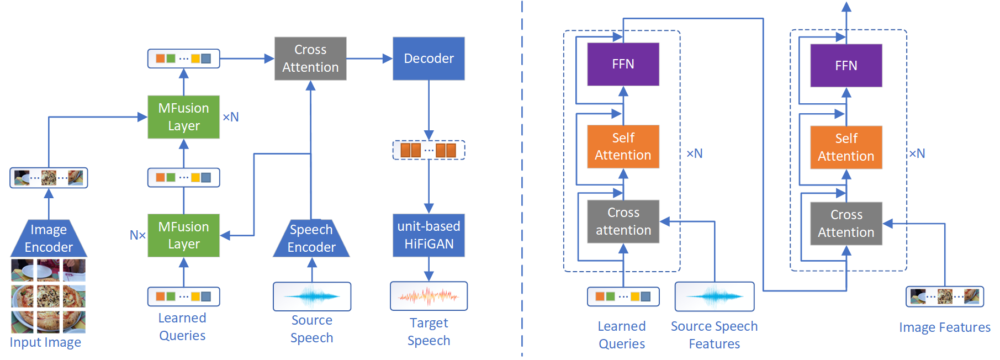

# M-Transpeech: Multimodal Textless Speech to Speech Translation
Table of Contents
[TOC]

## Abstract

Textless Speech-to-Speech Translation (S2ST) aims to translate speech in the source language into speech in the target language, without relying on or generating text in either the source or target language. Although textless S2ST has achieved satisfactory translation results, it is sometimes limited by the single modality of speech and may fail to fully understand the semantic context, leading to incorrect translations. Therefore, we propose a multimodal S2ST model, named M-Transpeech, incorporating visual features to supplement information that might be overlooked in the speech modality, thus better aiding speech translation. Considering the sacrifice of paired speech-image data, we employ pre-trained speech and image encoders to reduce training data requirements, and the features extracted by pre-trained encoders can also be effectively integrated in the subsequent M-Fusion module. To address the challenge that the extended length of speech and image sequences are difficult to fuse, we introduce M-Fusion module to better integrate speech and image features. Experiments show that M-Transpeech improves an average of 1.04 BLEU over single modality S2ST, proving the effectiveness of the visual modality in speech translation and the key importance of M-Fusion in integrating speech and visual features.

Figure 1: Structure of M-Transpeech model. In the left subplot, the speech and images are passed through the speech encoder and image encoder, respectively, to generate speech features and image features. These features are then fused together through M-Fusion module. The right subplot displays the structure of the M-Fusion module and illustrates how the learned queries are used to integrate the speech and visual features.

## Checkpoints
Each checkpoint comes with its own model code. Please use the corresponding model code to run the model checkpoints.

## Demos

## Citation
